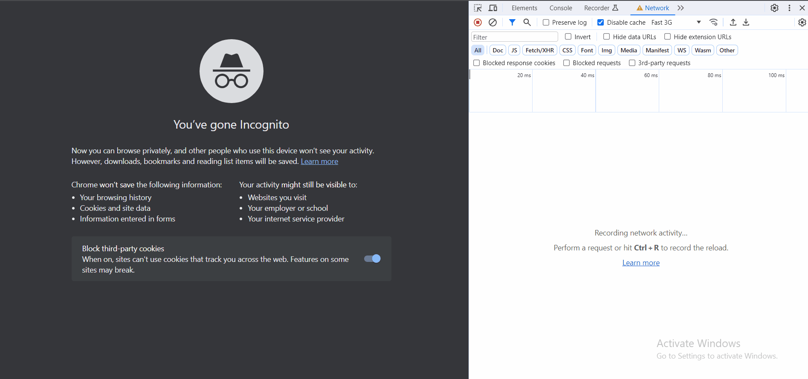

# htttp1.1vshttp2

This demo shows performance difference between HTTP1.1 & HTTP2 protocol.

In this demo, I have cropped a 500x500 image into 100 images with 50x50 and showing all the 100 images using both http1.1 and http2 protocol.

The servers are created using node's inbuilt http and http2 modules.

Please note that this example is little bit exaggerated since in real world example we don't have 100 images/assets in a web page but this is a good example to showcase power of multiplexing which is provided in http2 protocol.


## HTTP1.1 Example


## HTTP2 Example



## How to run

- Clone and cd into this repo
- Run
  ```bash
  node h1server.js
  ```
  ```bash
  node h2server.js
  ```
